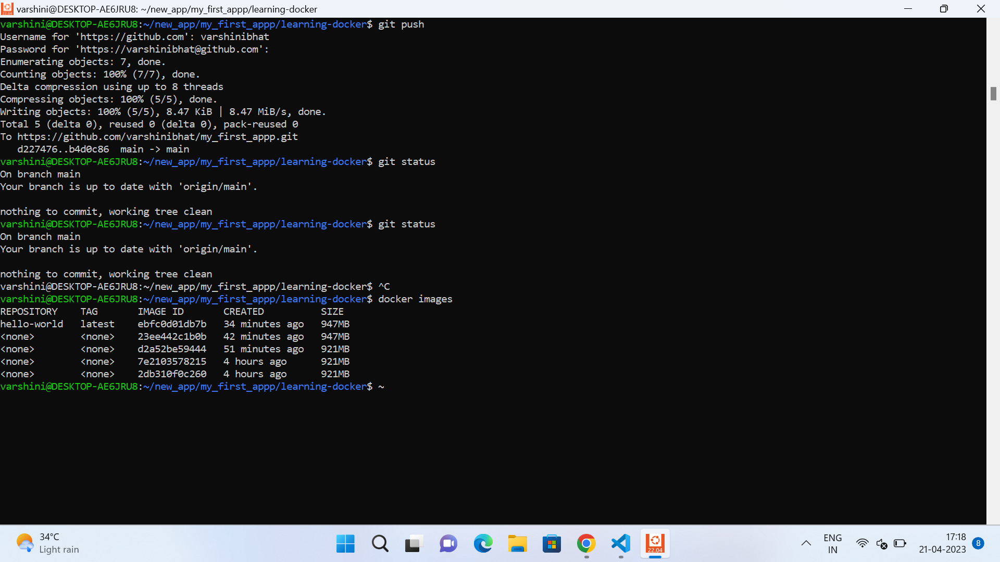
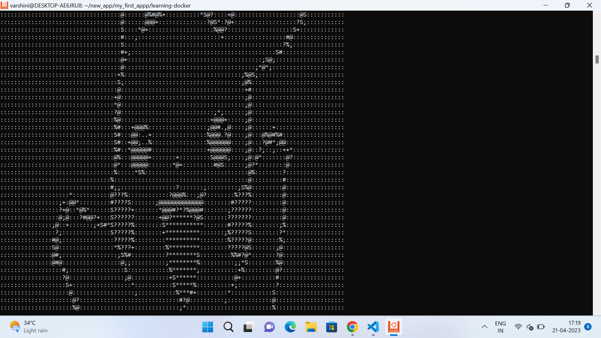
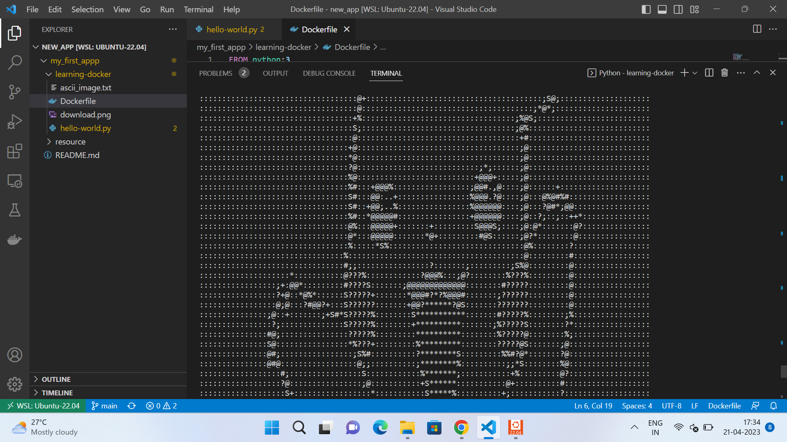

# my_first_appp
Screenshots:

1- Docker Image

2 -Docker Running

3 -App Output

1) What is the prerequisite for another machine to run your application if you provide it the docker image ?
ANS: Another machine on which we are running our application must have docker installed and working on it. All containers of the single machine share the operating system of the host.

2)  What is the difference between a virtual machine and a docker container ?
ANS: In Virtual Machines, each VM needs a full-blown Operating System, So it is slower to start and resource intensive.
     Containers allow running multiple apps in isolation and are lightweight, So starts quickly and needs less hardware resources.
     

